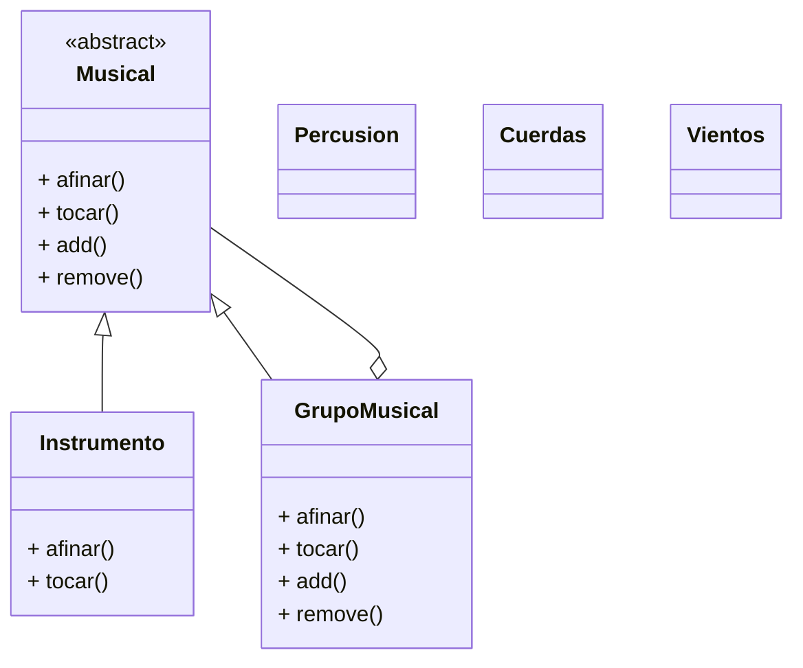

# Patrón Composite aplicado a un sistema musical

## INTEGRANTES:

### Dominic Felipe Robayo Devia 20241020072

### Julian Esteban Valencia Vargas 20241020048

---

## Descripción

Este repositorio contiene una implementación en Java del **patrón estructural Composite** aplicado a un sistema musical. La idea es poder tratar **Instrumentos** (hojas) y **GruposMusicales** (composites) de forma uniforme mediante una interfaz común (`Musical`).

Se incluye:

* Código fuente organizado por paquetes (clases `Musical`, `Instrumento`, `GrupoMusical`, `Percusion`, `Cuerdas`, `Vientos`, `Main`).
* Menú por consola para afinar/tocar, agregar y eliminar elementos, y listar la estructura.
* Diagrama UML en Mermaid listo para README.

---

## Prompt original

Detalles del diseño:

* Clase abstracta **Musical** con métodos:

  * `tocar(): void`
  * `afinar(): void`
  * `add(m: Musical)`
  * `remove(m: Musical)`
  * `getChildren(): List`
  * `getNombre(): String`

* Clase concreta **Instrumento** (hoja) que hereda de Musical.

  * Atributo: `nombre: String`
  * Implementa `tocar()`, `afinar()` y `getNombre()`

* Clase **GrupoMusical** (composite) que también hereda de Musical.

  * Atributos: `nombre: String`, `hijos: List`
  * Métodos: `tocar()`, `afinar()`, `add()`, `remove()`, `getChildren()`, `getNombre()`

---

## Estructura sugerida de carpetas

```
src/
 ├─ app/
 │   └─ Main.java
 └─ musical/
     ├─ Musical.java
     ├─ Instrumento.java
     ├─ GrupoMusical.java
     ├─ Percusion.java
     ├─ Cuerdas.java
     └─ Vientos.java
```

---

## Diagrama en Mermaid

Copia y pega este bloque directamente en tu `README.md` o en cualquier lugar que soporte Mermaid (GitHub lo renderiza):



---

## Prompt para generar TODO el código Java (usa exactamente esto)

````
Genera un proyecto Java por consola que implemente el patrón estructural Composite aplicado a un sistema musical. Quiero que me devuelvas **todos los archivos completos** listos para copiar en la estructura de carpetas indicada. Requisitos exactos:

Estructura de paquetes:
- package musical; (o musical para archivos simples) — o bien usa `package musical;` en los archivos que te pida.
- Archivos y clases que quiero (cada archivo con su contenido completo, incluyendo package y imports si aplican):

1. Musical.java
   - Clase abstracta `Musical` con métodos:
     + `public abstract void tocar();`
     + `public abstract void afinar();`
     + `public void add(Musical m)` que lanza UnsupportedOperationException por defecto
     + `public void remove(Musical m)` que lanza UnsupportedOperationException por defecto
     + `public List<Musical> getChildren()` que lanza UnsupportedOperationException por defecto
     + `public String getNombre()` que lanza UnsupportedOperationException por defecto

2. Instrumento.java
   - Clase `Instrumento` que extiende `Musical`.
   - Atributo privado `String nombre`.
   - Constructor que recibe `nombre`.
   - Implementa `tocar()` y `afinar()` imprimiendo texto plano (sin emojis) y `getNombre()`.

3. GrupoMusical.java
   - Clase `GrupoMusical` que extiende `Musical`.
   - Atributo privado `String nombre` y `List<Musical> hijos = new ArrayList<>();`
   - Implementa `tocar()` y `afinar()` imprimiendo bloques separadores (líneas) antes de listar hijos.
   - Implementa `add(Musical m)`, `remove(Musical m)`, `getChildren()` y `getNombre()`.

4. Percusion.java, Cuerdas.java, Vientos.java
   - Clases que extienden `GrupoMusical`. En su constructor llaman a `super("Percusión")` / `"Cuerdas"` / `"Vientos"` y agregan varios `Instrumento` (Batería, Congas, Bongós / Guitarra, Violín, Arpa / Flauta, Trompeta, Saxofón).

5. Main.java (package app)
   - Arma una `Orquesta` (instancia de `GrupoMusical`), le añade `new Percusion()`, `new Cuerdas()`, `new Vientos()`.
   - Provee un menú por consola con opciones:
     1. Afinar orquesta completa (llama a orquesta.afinar())
     2. Tocar orquesta completa (llama a orquesta.tocar())
     3. Agregar nuevo grupo (pide nombre del grupo padre, busca recursivamente y añade `new GrupoMusical(nombreNuevo)`)
     4. Agregar instrumento a un grupo (pide nombre del grupo padre, busca recursivamente y añade `new Instrumento(nombreInstrumento)`)
     5. Eliminar un grupo o instrumento (pide nombre y elimina el primer match dentro del árbol)
     6. Listar estructura de la orquesta (imprime en modo árbol con sangrías)
     0. Salir
   - Implementa un método `private static GrupoMusical buscarGrupo(GrupoMusical raiz, String nombre)` recursivo.
   - Implementa un método `private static boolean eliminarPorNombre(GrupoMusical raiz, String nombre)` que busque entre hijos y remueva la primera coincidencia (tanto para hojas como subgrupos).
   - Implementa `listarEstructura(GrupoMusical raiz, int nivel)` que imprime con sangrías (por ejemplo 2 espacios por nivel) la jerarquía completa.
   - Manejo básico de entradas (Scanner) y limpieza de buffer; imprime mensajes claros.

Entrega: Devuélveme **cada archivo completo** con su contenido (package line, imports, javadoc breve opcional) en bloques de código separados (```java ... ```), con la estructura de carpetas sugerida al principio del mensaje. No incluyas emojis, todo en texto plano. Asegúrate de que el Composite se use correctamente: `Main` no debe construir internamente los instrumentos (los grupos concretos se encargan de crear sus hijos), y `orquesta` es el composite raíz usado por el cliente.
````

---

## Prompt para generar el UML en Mermaid (usa exactamente esto)

```
Genera un diagrama de clases UML en formato Mermaid para el patrón Composite aplicado al sistema musical. Debe usar nombres y métodos adaptados al proyecto: `Musical`, `Instrumento`, `GrupoMusical`, `Percusion`, `Cuerdas`, `Vientos`. Requisitos:

- `Musical` como clase abstracta con:
  - <<abstract>>
  - + afinar()
  - + tocar()
  - + add()
  - + remove()

- `Instrumento` con:
  - + afinar()
  - + tocar()

- `GrupoMusical` con:
  - + afinar()
  - + tocar()
  - + add()
  - + remove()

- `Percusion`, `Cuerdas`, `Vientos` como clases concretas que heredan de `GrupoMusical`.

- Representa herencia (Musical -> Instrumento, Musical -> GrupoMusical).
- Representa la relación de composición entre `GrupoMusical` y `Musical` (un Grupo contiene 0..* Musical). No pongas etiquetas de "child" o "parent" encima de las flechas; las relaciones deben aparecer limpias. Si Mermaid no permite una única "flecha unificada" para dos herencias, dibuja las dos herencias separadas (es aceptable), pero la composición debe mostrarse desde `GrupoMusical` hacia `Musical`.

Devuélveme **el bloque Mermaid** listo para pegar en un README.md (entre triple backticks). No incluyas líneas extra que rompan el render de GitHub.
```

---

## Uso (compilar y ejecutar)

Desde la raíz del proyecto (suponiendo estructura `src/`):

```bash
# Compilar
javac -d out src/musical/*.java src/app/*.java

# Ejecutar
java -cp out app.Main
```

> Si usas paquetes en subcarpetas, ajusta la ruta de compilación: por ejemplo `javac -d out src/app/*.java src/musical/*.java` o usa una herramienta como Maven/Gradle.

---

## Ejemplo de ejecución

```
--- MENU ---
1. Afinar orquesta completa
2. Tocar orquesta completa
3. Agregar nuevo grupo
4. Agregar instrumento a un grupo
5. Eliminar un grupo o instrumento
6. Listar estructura de la orquesta
0. Salir
Seleccione una opción: 2

==============================
El grupo Orquesta comienza a tocar
==============================

--- El grupo Percusión comienza a tocar ---
Batería está tocando.
Congas está tocando.
Bongós está tocando.

--- El grupo Cuerdas comienza a tocar ---
Guitarra está tocando.
Violín está tocando.
Arpa está tocando.

--- El grupo Vientos comienza a tocar ---
Flauta está tocando.
Trompeta está tocando.
Saxofón está tocando.
```


